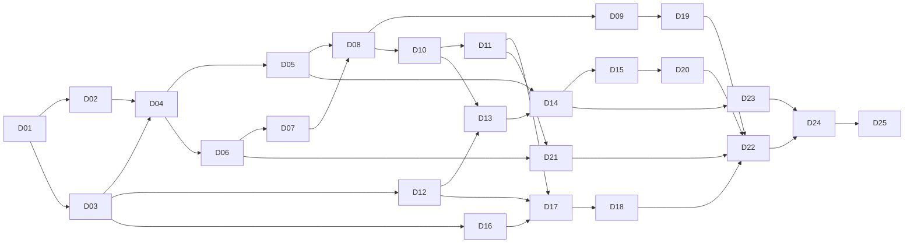

# Viram delivery plan

Drafted September 24, 2026. This is the **build order** for v1.0 and v1.1. It breaks the work into small deliverables, each ending in something you can see working. The [implementation plan](mvp-launch-implementation-plan.md) still owns the checkpoint gates and exit evidence. The [PRD](product-requirements.html) still owns the acceptance criteria. Each deliverable below points to both instead of repeating them.

## How deliverables work

- **One capability at a time.** Each deliverable is a thin, end-to-end slice, about 1–3 days of work for one engineer. It either runs on a physical iPhone and Android phone, or, for pure logic, is proven by tests in CI.
- **“You can…” is the demo.** A deliverable is done when someone other than its builder can follow its demo on both phones, and its “Done when” checks pass.
- **In order, with explicit needs.** Each deliverable starts only when the ones it needs are done. Anything not listed under “Not yet” belongs to that deliverable.
- **Riskiest first.** Guidance with the screen locked is the v1.0 promise and the biggest technical unknown, so it is proven in week 1 and built by week 3.
- **Definition of done for every deliverable:**
  - Automated tests for its logic, with CI green.
  - Screen-reader labels, 200% text, and reduced motion for any screen it adds.
  - Empty, error, and loading states for what it adds.
  - No health claims; works offline.
  - Docs updated.
  - Unfinished controls stay out of release builds.

  Accessibility and privacy are built into each deliverable, not left to a final phase. D22 only closes the gate.

## v1.0 at a glance

Sizes are engineering days for one experienced full-time engineer. “Week” is the week each deliverable finishes if built in order.

| # | Deliverable | You can… | Needs | Days | Week |
|---|---|---|---|---|---|
| **Foundations** | | | | | |
| D01 | Build baseline and CI | Install dev builds on both phones; every PR runs the checks | — | 2 | 1 |
| D02 | Locked-screen audio spike | Read a measured decision on how cues stay on time with the phone locked | D01 | 3 | 1 |
| D03 | Step engine | Compute any rhythm's rounds, duration, and pace (tests) | D01 | 2 | 2 |
| D04 | Session runner with tones | Run a practice with tones, pause, resume, and end, with correct time | D02, D03 | 3 | 2 |
| D05 | Guidance with the screen locked | Lock the phone and keep hearing cues; calls pause it | D04 | 3 | 3 |
| **First usable app** · Alpha 1 | | | | | |
| D06 | Local database foundation | Find your sessions after force-quit, update, or backup restore | D04 | 2 | 3 |
| D07 | App shell and first use | See first use once, then move between the four tabs | D06 | 2 | 4 |
| D08 | Breathe and the cue chip | Tap Begin on the ready practice; switch Voice, Tones, Silent, and haptics | D05, D07 | 2 | 4 |
| D09 | Completion and History | Finish, see your summary, and find every session in History | D08 | 2 | 5 |
| **Your rhythm** | | | | | |
| D10 | Adjust rhythm and targets | Build any rhythm and practise by minutes or rounds | D08 | 2.5 | 5 |
| D11 | My rhythms | Save, name, start, rename, and delete rhythms | D10 | 2 | 6 |
| **Library and voice** · Alpha 2 | | | | | |
| D12 | Practices and technique guides | Browse the eight practices, read a guide, and Begin it | D07, D03 | 2.5 | 6 |
| D13 | Technique-aware practice | Follow sides, Hum, mouth steps, and the ring guide; adjust a practice | D12, D10 | 2 | 6 |
| D14 | Voice guidance | Hear spoken cues and introductions, even when locked | D05, D13 | 2 | 7 |
| D15 | Sound controls | Set cue volume, play along with music, pick tones and haptic strength | D14 | 2 | 7 |
| **Sharing and quick start** | | | | | |
| D16 | Share-link codec | Turn any rhythm into a safe link and back (tests) | D03 | 1.5 | 8 |
| D17 | Share and receive in the app | Share a practice; open a link to preview, Save, or Begin | D16, D11, D12 | 2 | 8 |
| D18 | Links that open the app, and viram.app | Tap a viram.app link in Messages and land in Viram | D17, domain | 2.5 | 8 |
| D19 | App-icon quick actions | Long-press the icon to start a practice | D09 | 1.5 | 9 |
| **Settings and data** · feature complete | | | | | |
| D20 | Settings, About, and delete | Find every setting, read About, and delete your history | D15 | 1.5 | 9 |
| D21 | Export and import | Move your rhythms and history to another phone | D06, D11 | 2 | 9 |
| **Release** | | | | | |
| D22 | Accessibility and motion audit | Complete every flow with a screen reader, large text, and reduced motion | D01–D21 | 2.5 | 10 |
| D23 | Final voice clips | Hear the approved Viram voice everywhere, including “Hear it” | D14, voice lane | 1.5 | 10 |
| D24 | Closed beta | Install from TestFlight or Play closed testing and send feedback | D22, D23 | calendar | 10+ |
| D25 | Store release | Find Viram in both stores | D24 | calendar | — |

**Build total: about 49 engineering days, roughly 10 weeks before the beta.** That is a little above the earlier 8–9-week estimate, because the spike, CI setup, and final audit are now explicit. The PRD's cut line still applies: move D21's screens to v1.1 (keeping backup and migration safety) and ship one tone set in D15, which saves about 3 days. The beta adds calendar time: Google Play requires a 14-day closed test for new personal developer accounts.

**Checkpoint builds**

- **Alpha 1 (week 5, after D09):** a complete box-breathing app with locked-screen tones. Run the five moderated first-use tests the CP2 gate requires.
- **Alpha 2 (week 7, after D15):** the full library with voice (placeholder clips) and sound controls. Run 5–8 eyes-closed practice tests, including Nadi Shodhana sides.
- **Feature complete (week 9, after D21).**
- **Beta (from week 10, D24).**

---

## Foundations

### D01 · Build baseline and CI · 2 days

**You can:** install a development build on a physical iPhone and Android phone, open the current app, and see every pull request run the checks automatically.

**Build**
- Lock the iOS deployment target and the Android minimum and target SDK. Set up development builds for both platforms.
- Remove Apple Health and Health Connect from v1.0:
  - plugins, permissions, and the entitlement;
  - the v2 biometric-read code, the Progress route, and the trend and stat components.
  - v1.1-E brings back write-only session writing.
- Remove streak queries.
- Declare iOS background audio and the Android `mediaPlayback` foreground service, which D02 needs.
- Add a unit-test runner. Add a CI workflow running `typecheck`, `check:content`, `check:theme`, and the tests.

**Done when:** CI passes on a PR; both device builds launch; the release `Info.plist` and manifest show no Health or microphone permission.

**Covers:** CP0.

### D02 · Locked-screen audio spike · 3 days (decision; code is thrown away)

**You can:** read a decision record, backed by device measurements, that says how Viram keeps cues on time with the screen locked.

**Build**
- A dev-only test screen that plays a 20-minute 4 · 4 · 4 · 4 tone session and logs when each cue actually plays.
- Compare two approaches:
  - **(A)** render the session as one continuous audio track (tone clips plus silence) and play it as background media;
  - **(B)** a small native scheduler on the audio clock.
- Test each with the phone locked, in Low Power Mode, battery saver, and Doze, with Bluetooth headphones, and with music playing.
- Try pause and resume and the lock-screen controls with each.

**Done when:** `docs/decisions/locked-audio.md` records drift per device and the chosen approach. If neither approach holds ±250 ms, the owner decides the fallback before D04 starts, because that changes the v1.0 promise.

**Covers:** CP1b's audio-clock decision; FR-02 and FR-04 feasibility.

### D03 · Step engine · 2 days (pure logic)

**You can:** see tests prove that any rhythm's round length, planned rounds, planned duration, guided breaths per minute, and current step match the PRD examples.

**Build**
- A step model shared with `src/content/types.ts`: kind, seconds, side, route, and cue.
- Bounds: inhale and exhale 1–20 s, hold and rest 0–20 s, halves only where a technique allows them.
- Targets by minutes (rounded up to whole rounds) or by rounds.
- `stepAt(elapsed)`, which skips 0-second steps.
- Replace the prototype's four-phase `PatternConfig`, and adapt the existing screens to the new model.
- `check:content` switches to the engine's math instead of its own copy.

**Done when:** tests cover these cases:
- box 19 rounds / 5:04 and 4 · 4 · 6 · 4 at 17 / 5:06;
- Nadi Shodhana 15 / 5:00, coherent 28 / 5:08, and 4-7-8 at 4 rounds / 1:16;
- 0-second skipping, boundaries, and rejected out-of-bounds values.

**Covers:** FR-01 (math) and FR-02; CP1.

### D04 · Session runner with tones · 3 days

**You can:** start box breathing from a dev entry point, watch the guide and count, hear a tone on every step, pause and resume (a 3-second countdown restarts the step), end early after confirming, or let it finish on a whole round. Time and rounds come out right.

**Build**
- A session state machine: settling → running → paused (with a reason) → completed or ended.
- A monotonic clock; tone cues on the D02 audio approach; the visual guide reads the same clock; haptics on each step.
- A 3-second settle countdown and the End flow: “End this practice?” with Keep breathing.

**Not yet:** voice (D14), side and route labels (D13), saving records (D06).

**Done when:**
- Tests cover pause and resume accounting.
- On a device, a 5-minute box practice finishes within ±250 ms of 5:04.
- The screen never shows a running timer while paused.

**Covers:** FR-02 and the duration contract (start, pause, end early); CP1.

### D05 · Guidance with the screen locked · 3 days

**You can:**
- lock the phone during a Tones practice and keep hearing every cue;
- see the practice, round, and time left on the lock screen, with Pause and Resume (and End on Android);
- have a call, Siri, an alarm, another app's audio, or disconnected headphones pause it, then see “Paused for a call” (or the other reason) when you return.

**Build**
- iOS: background audio and Now Playing.
- Android: the `mediaPlayback` foreground service and media notification.
- Interruption and audio-route handling.
- The Silent-mode rule: continue with haptics on Android, otherwise pause on lock.
- Keep-awake only in Silent mode.
- A force-quit never creates a completed record.
- A one-time tip on the settle screen: “You can lock your phone. The voice keeps guiding.”

**Done when:** CP1b's exit evidence passes on a physical iPhone and Android phone:
- 5- and 20-minute locked sessions stay within ±250 ms, including in Low Power Mode, battery saver, and Doze;
- calls pause the session;
- nothing plays after End.

**Covers:** FR-04; CP1b.

## First usable app · Alpha 1

### D06 · Local database foundation · 2 days

**You can:** finish or end a practice and still find its record after force-quitting, updating the app, or restoring the phone from a backup.

**Build**
- A fresh schema v1 with a forward-only, versioned migration runner. The prototype's database never shipped, so there is nothing to migrate.
- Repositories for sessions and preferences. Session records use the FR-05 fields: name and step snapshots, target, completed rounds, pace, and completion state.
- Atomic writes and a recoverable error state.
- The database is included in iOS backups and in Android Auto Backup rules.
- Screens never touch SQL.

**Done when:** migration tests pass; a kill-during-write test loses nothing; backup and restore are checked by hand on both platforms.

**Covers:** FR-05, and FR-21's backup and migration rules; CP4.

### D07 · App shell and first use · 2 days

**You can:** install fresh, see one welcome screen with comfort guidance and the wellness disclaimer, tap Continue, and land on Breathe with Sama Vritti ready for 5 minutes. From there, move between the Breathe, Practices, History, and Settings tabs.

**Build**
- Four-tab navigation.
- The first-use screen, shown once, with the safety language from FR-07.
- No permission prompts.
- Practices and History show simple empty states until their deliverables land.

**Done when:** first use appears exactly once; reading order and 200% text are checked on both platforms.

**Covers:** FR-13 and FR-07; CP2.

### D08 · Breathe and the cue chip · 2 days

**You can:** open the app and tap Begin on the ready practice; switch between Voice, Tones, and Silent, and turn haptics on or off, from the cue chip; relaunch and find your last practice and cue choice remembered.

**Build**
- The Breathe screen: a ready-practice card showing the rhythm, target, planned rounds and duration, and pace, with Begin and an entry to Adjust rhythm.
- The cue chip sheet.
- Saved preferences. Defaults: Voice on, haptics on, motion follows the system.
- Voice plays tones until D14 (the FR-03 missing-clip fallback).

**Done when:** preferences survive a relaunch; controls have screen-reader labels and states.

**Covers:** FR-01 (Breathe) and FR-03 (modes); CP2.

### D09 · Completion and History · 2 days

**You can:** finish a practice and see “A little space, made.” with your time, rounds, and pace, then tap Done or Breathe again. In History, see every completed or ended-early session and open its detail.

**Build**
- The completion screen, per the PRD's completion rule.
- The History list and detail, plus an empty state.
- No streaks, scores, or charts.

**Done when:** records match the actual time and rounds for completed sessions, ended-early sessions, and sessions ended with zero rounds.

**Covers:** FR-05 (display); CP4.

**Alpha 1 ships here.** Run the five moderated first-use tests (the CP2 gate).

## Your rhythm

### D10 · Adjust rhythm and targets · 2.5 days

**You can:** open Adjust rhythm and:
- set a four-step rhythm in whole seconds, with holds Off if you like;
- choose minutes (1, 3, 5, or 10) or rounds (1–108, with 11, 21, and 27 as shortcuts);
- watch round length, planned rounds, duration, and pace update as you change them;
- tap Use this rhythm to go back to Breathe.

**Build**
- The builder with accessible steppers, replacing the prototype's setup screen.
- The rounds target end to end: the session ends after N rounds, and the lock screen shows rounds left.

**Done when:** 4 · 0 · 6 · 0 for 21 rounds shows 3:30 and 6 breaths/min, then runs exactly 21 rounds; invalid values can't be entered.

**Covers:** FR-01; CP1b (rounds target).

### D11 · My rhythms · 2 days

**You can:** save the rhythm you built with a name, find it under My rhythms in Practices, start it, rename it, or delete it. History keeps the old name.

**Build**
- A saved-rhythms table (up to 20) and its repository.
- Save from the builder.
- The limit message at 20; an in-page delete confirmation.

**Done when:** tests cover the 20 limit, plain-text names of 1–40 characters, and rename or delete leaving History snapshots unchanged.

**Covers:** FR-10; CP2b.

## Library and voice · Alpha 2

### D12 · Practices and technique guides · 2.5 days

**You can:** browse the eight practices (classical and modern), open any guide, read its name, respelling, rhythm, Take care, how-to, tradition, research, and sources, and Begin it with its defaults.

**Build**
- The library list and technique guide, reading `src/content`.
- Rhythm summaries computed by the engine.
- “Reviewed by” appears only from a recorded review.
- Take care stays above the fold on small phones at 200% text.
- “Hear it” stays hidden until D23 adds the clips.

**Needs a decision:** the coherent-breathing name, because its ID ends up in share links.

**Done when:** all eight guides render from the content data, and each practice starts with its own steps.

**Covers:** FR-08 and FR-09; CP2b.

### D13 · Technique-aware practice · 2 days

**You can:**
- follow Nadi Shodhana with a side indicator and “Inhale left” / “Exhale right” labels;
- see Bhramari's Hum step and the “through the mouth” steps in Sheetali and 4-7-8;
- follow coherent breathing's ring guide instead of numbers;
- adjust any library practice without losing its sides or structure.

**Build**
- Practice-screen variants: sides shown by shape and text (not color), Hum, the route label, and the half-second ring guide.
- Step captions from the content data.
- Adjust rhythm for library practices, keeping each practice's structure and its whole- or half-second step size.
- Saving an adjusted practice keeps its technique ID.

**Done when:** every Nadi Shodhana step shows and announces the right side, and the ring guide appears for half-second steps.

**Covers:** FR-01 (library adjust), FR-03 (side labels), and FR-09; CP2b.

### D14 · Voice guidance · 2 days (placeholder clips)

**You can:**
- choose Voice and hear “Inhale”, “Exhale left”, “Hum”, or “In through the mouth” on each step, including with the phone locked;
- hear an optional spoken introduction with captions before settling (First time, Always, or Never), and skip it.

**Build**
- A clip manifest with lengths measured at build time; the build fails when a clip is over its limit.
- Cue choice from `cueFor` in `src/content/voice.ts`.
- Scheduling on the D02 timeline.
- Tones play instead when a step is shorter than its clip plus 0.2 s, or a clip is missing.
- Introductions don't count as practice time.
- The About text disclosing the AI voice.
- Placeholder clips come from any text-to-speech voice and are marked as not for release.

**Done when:** fallback timing tests and the manifest check run in CI, and a locked voice session stays within ±250 ms.

**Covers:** FR-03 (voice) and the PRD's AI-voice rules; CP2b.

### D15 · Sound controls · 2 days

**You can:**
- set cue volume separately from media volume;
- play along with your music (lowered briefly during cues) or pause it;
- pick Soft bells, Wood, or Chimes;
- set haptic strength;
- keep the screen on during practice.

**Build**
- The settings, with the audio session set per platform for mixing or exclusive playback.
- Tone-set assets from the sound-design lane.
- Haptic strength patterns and the keep-awake option.

**Done when:** with music playing, cues lower it briefly and it comes back; each tone set has distinct step sounds; choices survive a relaunch.

**Cut line:** ship one tone set.

**Covers:** FR-03 (sound controls); CP1b.

**Alpha 2 ships here.** Run 5–8 eyes-closed practice tests, including Nadi Shodhana sides.

## Sharing and quick start

### D16 · Share-link codec · 1.5 days (pure logic)

**You can:** see tests prove that any library practice's settings or saved rhythm becomes a `https://viram.app/r/…` link and decodes back exactly, and that malformed or out-of-bounds links are rejected.

**Build**
- A versioned, compact encoding carrying a plain-text name (up to 40 characters), the steps, the target, and an optional technique ID.
- Strict validation; decoding works offline.
- Fuzz tests.

**Done when:**
- Round-trips pass for all eight practices and a custom rhythm.
- 10,000 fuzzed links never crash the decoder or get accepted out of bounds.
- Links stay within a set length budget.

**Covers:** FR-11 (format) and the design review's share-link safety rules; CP2b.

### D17 · Share and receive in the app · 2 days

**You can:**
- tap Share on a practice or rhythm, see exactly what the link contains, and send it;
- open a received link to see a preview with Take care from your installed library, then Save or Begin;
- see “This link can't be opened” for a bad link.

**Build**
- The share preview and system share sheet.
- The incoming route, preview, and invalid state.
- Save to My rhythms, following the 20 limit.
- A link opened before first use goes through first use, then to the preview.
- The app's own link scheme works now; D18 adds web links.

**Done when:** link content never renders as markup, and safety text comes only from app content.

**Covers:** FR-11 and FR-10 (save from a link); CP2b.

### D18 · Links that open the app, and viram.app · 2.5 days

**You can:** tap a viram.app/r/… link in Messages, WhatsApp, or Mail and land in Viram's preview on iPhone and Android. Without Viram installed, the link opens a small page showing the rhythm with store links.

**Build**
- The static viram.app site:
  - the web fallback, which decodes the link in the browser and shows plain text only;
  - the privacy policy page;
  - `apple-app-site-association` and `assetlinks.json`;
  - no cookies or trackers.
- Associated domains and Android intent filters.
- Hosting.

**Needs:** viram.app registered and hosted (owner lane).

**Done when:** links open correctly from three messaging apps on physical devices.

**Covers:** FR-11 (web fallback) and FR-06; CP2b.

### D19 · App-icon quick actions · 1.5 days

**You can:** long-press the app icon, choose “Begin last practice”, “1-minute box breathing”, or your most recent other practice, and land on the settle countdown with Cancel.

**Build**
- Confirm the quick-actions library works with Expo SDK 57.
- Build the actions from History.
- Route correctly on cold and warm launch.
- Before first use, a quick action opens first use and then continues.

**Done when:** cold and warm launches work on both platforms, and screen readers read the action titles.

**Covers:** FR-12; CP2b.

## Settings and data · feature complete

### D20 · Settings, About, and delete · 1.5 days

**You can:**
- find every setting in one place: cues and sound, introductions, haptics, motion, safety and wellbeing, and privacy;
- read About, with the free-core promise, the source list, and the AI-voice disclosure;
- delete your history after an in-page confirmation, while preferences and My rhythms stay.

**Build**
- The Settings restructure, replacing the prototype's screen.
- About lists `SOURCES` in two groups: books and texts, and studies.
- “Rate Viram” lives in About only, and the app never prompts for a rating.
- Safety and wellbeing uses the general Take care drafted in the [content research](content/technique-research.md).

**Covers:** FR-07, FR-22, and FR-05 (deletion); CP4.

### D21 · Export and import · 2 days (cut-line candidate)

**You can:** export your rhythms, history, and preferences as one file through the share sheet, then import it on another phone. You see a summary first, nothing is duplicated, and a bad file imports nothing.

**Build**
- A versioned JSON format, checked in CI.
- Import validation reusing the link rules: bounds, plain-text names, and known technique IDs.
- A merge by ID.

**Cut line:** keep D06's backup and migration safety, and move these screens to v1.1.

**Covers:** FR-21; CP4.

## Release

### D22 · Accessibility and motion audit · 2.5 days

**You can:** complete every core flow with VoiceOver and TalkBack, at 200% text, and with reduced motion. That includes Nadi Shodhana sides, a received link, and practising with the screen locked.

**Build**
- An audit across every screen, plus fixes.
- Step and side announcements; focus order.
- Touch targets of 44 pt on iOS and 48 dp on Android.
- A static guide under reduced motion that keeps the count, labels, and cues.

**Covers:** the CP3 gate.

### D23 · Final voice clips · 1.5 days, plus the voice lane

**You can:** hear the real Viram voice for every cue, introduction, and name. “Hear it” now appears on the guides, and every clip has been approved by listeners.

**Build**
- Generate the clips with [the lexicon](content/viram-lexicon.pls) under the paid licence.
- Measure and bundle them, and update the manifest.
- Record the listener approvals and the voice gate: at least 8 listeners, median 4/5 or better.
- Keep the masters and generation settings.

**Covers:** the PRD's AI-voice rules; CP2b's voice exit; a release blocker.

### D24 · Closed beta · calendar time

**You can:** install from TestFlight or Play closed testing, use v1.0 for at least 14 days, and send feedback. Crashes are reported only with consent.

**Covers:** CP6.

### D25 · Store release

**You can:** find and install Viram in both stores, with a staged rollout monitored for crashes, starts, and completions.

**Covers:** CP7.

---

## Parallel lanes (not engineering time)

| Lane | Work | Needed by |
|---|---|---|
| Owner | Register viram.app; open the Apple and Google developer accounts (Play's closed test needs 14 days); start trademark clearance for Viram, asking about “Coherent Breathing” too | Now; the domain by D18 (week 8) |
| Decisions | The coherent-breathing name; confirm the whole-phrase side cues | D12 (week 6) |
| Sound design | Three tone sets (Soft bells, Wood, Chimes), each with distinct inhale, hold, exhale, and rest sounds, plus a completion sound. The prototype's tones can become Soft bells. | D15 (week 7) |
| Voice | Buy a paid ElevenLabs plan and choose the voice; generate clips with the lexicon; recruit a Sanskrit or Hindi listener and the 8-listener panel | Placeholders by D14; final clips by D23 |
| Content | Check the Iyengar and Satyananda points against print copies; open the TIME source once in a browser | Before D24 |
| Design and copy | Final copy for empty, error, limit, invalid-link, and paused states; store screenshots | D17–D21; D24 |
| Research | The four v1.1 techniques; 6–8 teacher interviews (for v1.2) | During v1.0 |
| Testing | 5 moderated first-use tests; 5–8 eyes-closed practice tests | Alpha 1; Alpha 2 |

## Checkpoint gates by deliverable

| Gate | Closes when these are done |
|---|---|
| CP0 · Buildable baseline | D01 (and D02's decision) |
| CP1 · Timing and lifecycle | D03, D04 |
| CP1b · Locked-screen audio and sound | D02, D05, D10 (rounds), D15 |
| CP2 · First use and navigation | D07, D08, plus the Alpha 1 first-use tests |
| CP2b · Library, voice, sharing | D11–D14, D16–D19, D23 |
| CP3 · Accessibility | Each deliverable's definition of done, then D22 |
| CP4 · Records and user control | D06, D09, D20, D21 |
| CP6 · Beta | D24 |
| CP7 · Store | D25 |

---

## v1.1 deliverables

These follow the same rules. Each builds on v1.0 without regressing its gates. Details and exit evidence are in the implementation plan's v1.1 track.

| # | Deliverable | You can… | Needs | Days |
|---|---|---|---|---|
| E01 | Routine builder | Chain 2–6 practices (repeats allowed) with minutes each, and see the planned total | v1.0 | 3 |
| E02 | Routine runner | Run a routine with 5-second transitions and see each practice in the summary | E01 | 3 |
| E03 | Gentle progression | After 5 completed sessions, get one next step (Try it, Not now, Stop suggesting), and always “Make it easier next time” | v1.0 | 2.5 |
| E04 | Practice calendar | See a month of practice days and minutes, with no streaks | v1.0 | 2 |
| E05 | Daily reminder | Turn on one gentle reminder; permission is asked only then | v1.0 | 1.5 |
| E06 | Health session writing | Add finished sessions to Apple Health or Health Connect, once each | v1.0 | 4 |
| E07 | Fuller voice | Turn on counting within steps and longer introductions | v1.0 | 2 |
| E08 | Program engine | Enroll in a program and have the next session chosen, counted, and kept across updates | E02, E03, E05 | 3 |
| E09 | Program screens | Start Foundations, see the next session on Breathe, return after a break, and finish or leave | E08 | 3 |
| E10 | Night practice | Practise on a true-black, dimmer surface at night | v1.0 | 2 |
| E11 | Gradual slowing and half-second builder | Slow from one pace to another across a session; set half seconds in the builder | v1.0 | 3 |
| E12 | Library additions | Practise Dirgha, Udgeeth, Chandra Bhedana, and cyclic sighing, and find Nadi Shodhana as “Anulom Vilom” | Content research | 3 |

**v1.1 total: about 32 engineering days (about 6.5 weeks),** matching the earlier estimate. E12's content research and the “Om” and “Top up” clips run in the content and voice lanes during v1.0.
